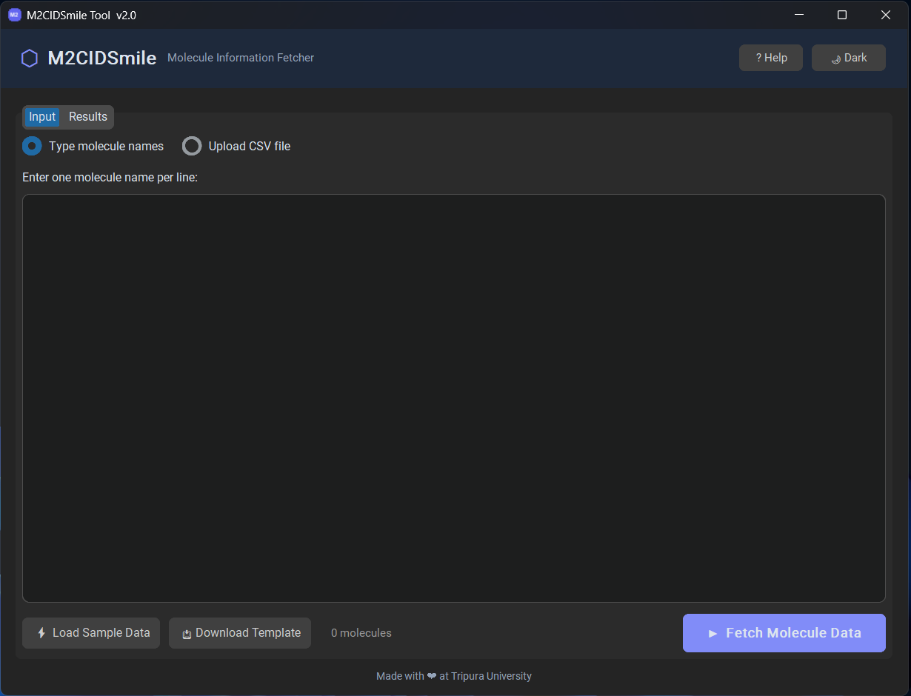
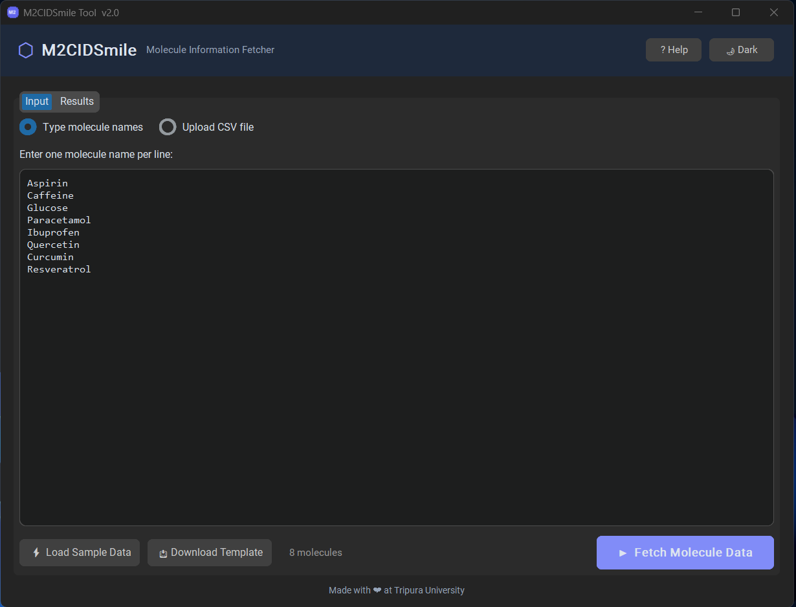
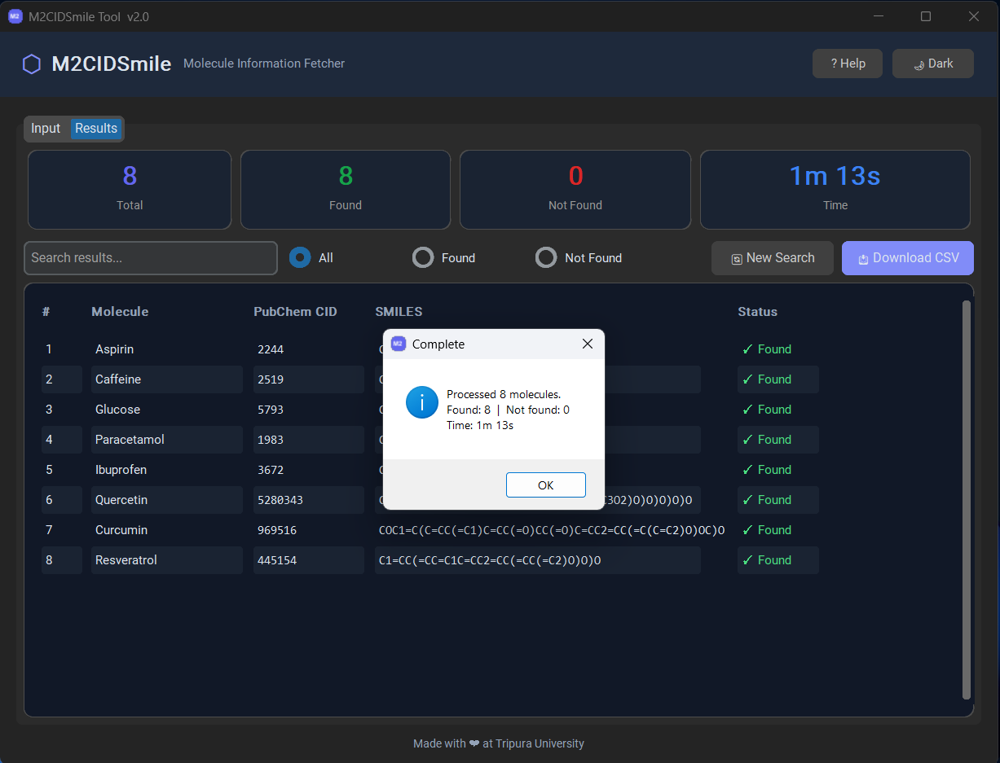
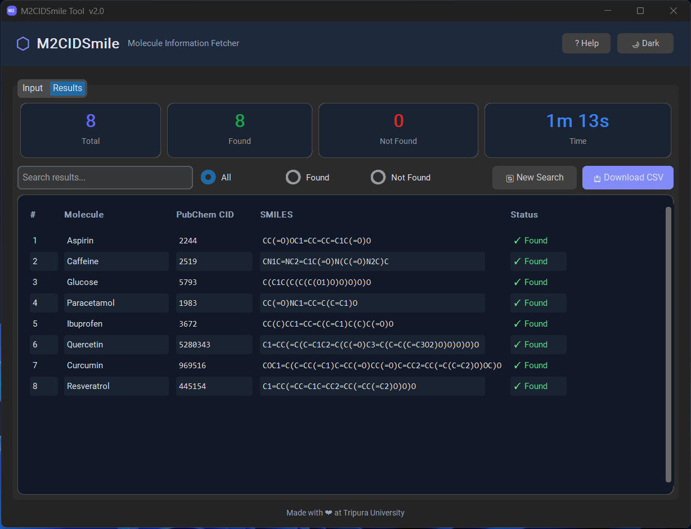

# M2CIDSmile-Tool

**Original Repository:** [https://github.com/Ara198221/M2CIDSmile-Tool](https://github.com/Ara198221/M2CIDSmile-Tool)

Title:
Utility Tool for Fetching PubChem IDs and SMILES Strings from Molecule Names Using Public Molecular Databases

Abstract:
The ability to create large datasets of molecules and retrieve their SMILES strings and molecular identifiers is important in chemical informatics. The provided R code demonstrates a comprehensive method for obtaining PubChem IDs and canonical SMILES notations for a list of molecules. Utilizing the httr and jsonlite libraries, the code defines a function, `get_pubchem_info`, that processes each molecule name by making API requests to the PubChem database.

The function first retrieves the PubChem CID (Compound Identifier) and then uses this CID to fetch the canonical SMILES string, a standardized representation of a molecule’s structure. The code handles errors gracefully, ensuring that API request failures do not interrupt the entire process.

The script reads molecule names from an input CSV file, processes each name to gather the required chemical information, and combines the results into a unified data frame. Finally, it writes the consolidated data to an output CSV file, enabling easy analysis and further utilization.

This R script is particularly useful for researchers and chemists who need to automate the retrieval of molecular identifiers and structures from PubChem. It streamlines the data acquisition process, reduces manual lookup efforts, and ensures data consistency, thereby improving productivity and accuracy in chemical informatics studies.

For input file preparation, molecule names should be collected from any public domain database such as KNApSAcK (http://www.knapsackfamily.com/KNApSAcK/
) or IMPPAT (https://cb.imsc.res.in/imppat/basicsearch/phytochemical
) and saved in a file named molecules.csv. The CSV file must contain molecule names under the column header molecule, as specified in the README instructions.

Output:
The code will generate an output CSV file containing the PubChem ID (CID) and the canonical SMILES string for each molecule.

## Screenshots

### Input Screen

### Sample Data Loaded

### Results

### Processing Complete

******** Enjoy the tool for basic research********
